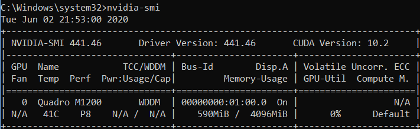

# demostrate PyTorch with mnist dataset on CPU and GPU
This project used both high-level API (i.e., sequential model, with GPU) and medium-level API (i.e, subclassing model, with CPU) to build NN model.

Using tensorflow 2.2 (see the project mnist_digits_CNN_demo):

2 sec per training epoch using GPU.

Using pytorch 1.5:

12 sec per training epoch using GPU

33 sec per training epoch using CPU.

 
 
   
